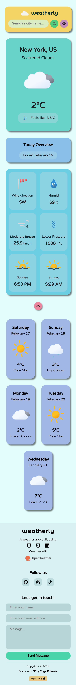
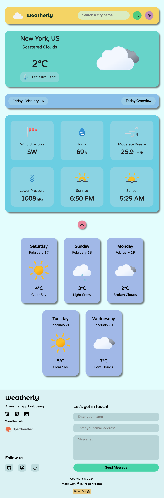
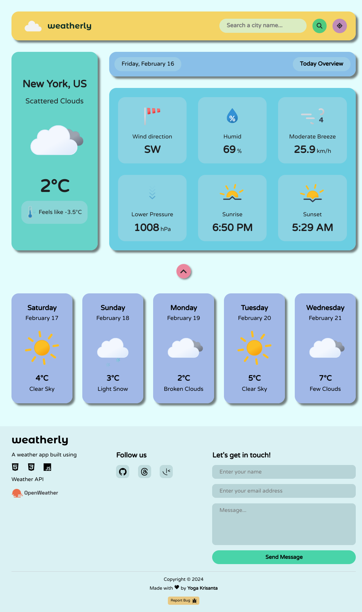

# weatherly - a beautifully-designed weather app

## Table of contents

- [Overview](#overview)
- [Screenshot](#screenshot)
- [Tech Stack](#tech-stack)
- [Author](#author)

### Overview

weatherly is a beautifully-designed weather app built using HTML5, CSS3, and asynchronous JavaScript. The weather data is fetched from Open Weather API.

You can easily check the current weather in your city by searching the city name in the search bar. It also has a geolocation feature, which you can use to determine your current location.

weatherly also provides five day forecast, so you can check the following five day weather.

### Screenshot

#### Mobile Screenshot

#### Tablet Screenshot

#### Desktop Screenshot

### Tech Stack

This project is built with:

- HTML5
- CSS3 Flexbox
- JavaScript (Asynchronous Programming)
- Rest API

### Author

- Website - [Yoga Krisanta](https://yogskr.github.io/personal-website)
- Frontend Mentor - [@yogskr](https://www.frontendmentor.io/profile/yogskr)
- GitHub - [@yogskr](https://www.github.com/yogskr)
- Twitter - [@yogskr\_](https://www.twitter.com/yogskr_)
